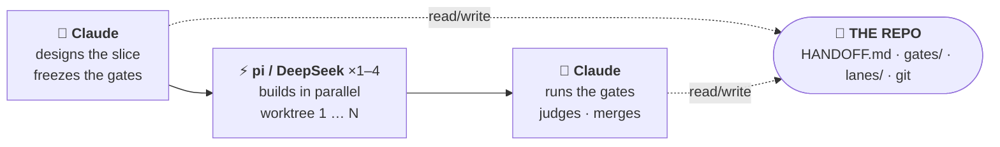
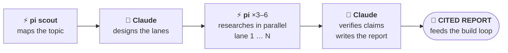

# architect-loop

**Claude handles planning and review; a cheap model — DeepSeek by default,
run via [`pi`](https://pi.dev) — handles implementation and research.** Two Claude
Code skills wire that split into a repo-centered loop: specs and gates are written
first, the builder works in fresh contexts, and Fable reviews the evidence before
anything is integrated.

> ⚠️ **Run this in a container.** `pi` has no sandbox — a builder runs with full
> host access and your repo's source is sent to a third-party (overseas) model
> API. Use the bundled devcontainer (or any container/VM) and don't point it at
> secrets or code you can't send out. This is the deliberate trade for a
> provider-agnostic, rock-cheap builder; if that trade is wrong for you, the
> upstream [DanMcInerney/architect-loop](https://github.com/DanMcInerney/architect-loop)
> runs the same loop on flat-rate Codex instead.

## Install

**Option A — DevPod (recommended)**

```bash
export DEEPSEEK_API_KEY=sk-...   # forwarded into the container automatically
devpod up https://github.com/pcomans/architect-loop-pi --ide none
```

The devcontainer handles Node 22, Python, `pi`, `install.sh`, `pip install ddgs`, and key forwarding automatically.

> **Fedora / Bazzite / RHEL users:** SELinux labels new workspace directories as `user_home_t`, which blocks container access. Run this once after installing DevPod:
> ```bash
> sudo semanage fcontext -a -t container_file_t "/var/home/$USER/.devpod/agent/contexts/default/workspaces(/.*)?"
> sudo restorecon -Rv ~/.devpod/agent/contexts/default/workspaces/
> ```
> Ubuntu, Debian, macOS, and WSL users are unaffected.

**Option B — Manual**

```bash
git clone https://github.com/pcomans/architect-loop-pi
cd architect-loop-pi
npm i -g --ignore-scripts @earendil-works/pi-coding-agent@latest  # the builder (pi)
./install.sh                                                      # skills + pi-search-hub  (Windows: .\install.ps1)
pip install ddgs                                                  # keyless DuckDuckGo backend for web_search
export DEEPSEEK_API_KEY=sk-...                                    # see dispatch.md to use GLM/Kimi/etc.
```

`./install.sh --project` installs the **skills** to the current repo
(`./.claude/skills/`) instead of `~/.claude/skills/`; `pi` and the `pi-search-hub`
package always install globally. You need
[Claude Code](https://claude.com/claude-code) on any paid plan, `pi`, and a
`DEEPSEEK_API_KEY`. `install.sh` also installs the
[`pi-search-hub`](https://pi.dev/packages/pi-search-hub) package for the
`web_search` tool. Its keyless DuckDuckGo backend needs the `ddgs` Python package
(above); for better results set `SEARCH_TAVILY_API_KEY` (Tavily).

`--ignore-scripts` blocks install-time scripts (the common npm-poisoning vector).

### Hardening (optional)

`npm config set min-release-age 4` (writes `~/.npmrc`) makes **every** npm install
— pi, pi-search-hub, deps — only pull versions public ≥4 days, so a poisoned
release has time to be caught and yanked. The devcontainer sets this
automatically; on a host machine it's opt-in (it changes your global npm config).
Raise the number for more seasoning — but note ≥5 days currently pulls an older pi
0.78.x, since 0.79.x is still recent.

**Confined parallel lanes** use `confined-pi.sh` — see [Isolation model](#isolation-model)
below. The devcontainer allows it; some Docker setups need
`--security-opt seccomp=unconfined` or userns-remap.

## Use (two commands)

```
/architect                                      # the build loop
/architect-research <what you're considering>   # the research loop
```

`/architect` runs one work block: judge the last run, spec the next slice,
dispatch builders. `/architect-research` is for when you're still deciding
*what* to build — its cited report feeds the build loop's PRD.

## How the loop works

The whole system is one split: **Claude (Fable) is the architect** — it
plans, judges, and integrates, but never writes implementation code — and
**`pi` builders (DeepSeek by default) write the code**, each in an isolated git
worktree. There is no shared in-memory state between them: **the repo is the
only memory**, so every fact that survives a session has to be written to a
file under `docs/`. "Not in the repo = didn't happen."

A single `/architect` work block runs as a short Fable session that moves a
one-PR slice through six stages:

1. **Ground.** Read the project's operating docs (`CLAUDE.md` → `README.md` →
   architecture), learn the exact verification commands, read `docs/HANDOFF.md`
   and every gate file it points to. The handoff is the entry point — a short
   (~150-line) table of contents, not a log.
2. **Arbitrate & judge the *previous* run.** Rule on every open disagreement
   (ACCEPT/REJECT/MODIFY), then run each frozen gate command yourself and
   compare the output to the verbatim gate text → PASS/FAIL/INVALID. Builder
   claims are hearsay; gate-pass is necessary but not sufficient, so the diff is
   also read against the spec's intent. **Crucially, a run is never judged in
   the session that dispatched it** — judgment always happens with fresh context.
3. **Spec the next slice.** Write the full delegation contract: objective,
   output format, verification commands, boundaries (files it may/may not
   touch), and a lane plan splitting the slice into 1–4 parallel lanes whose
   file-touch sets are checked for overlap (overlap → run as one lane).
4. **Freeze the gates.** Acceptance commands + thresholds are written to
   `docs/gates/<slice>.md` and committed *before* any builder starts. This
   freeze commit is the last thing before dispatch; gate files are read-only,
   and a builder edit to one (caught by `git diff`) auto-fails the slice.
5. **Dispatch builders.** One fresh `pi` run per lane, off the freeze commit:
   one lane runs in the main checkout, 2–4 lanes each get their own
   `git worktree` + branch, all launched in the background. Each builder argues
   with the spec first (PHASE 0 — silent compliance is a defect), builds only
   its declared files, runs the gates, and writes raw results to
   `docs/lanes/<slice>-<lane>.md`. **Builders never commit.** The session ends
   here — multi-hour runs are normal; liveness/stall checks happen on return.
6. **Post-flight & integrate.** When runs finish, verify per lane: results are
   in the lane report, PHASE 0 disagreements were raised, `docs/gates/` is
   clean, only in-bounds files changed, and no builder commits exist. Then the
   architect (not the builder) commits each passing lane, merges them
   sequentially into `slice/<name>` running gates after each merge, and
   consolidates the lane reports into `docs/HANDOFF.md`. The verdict on the
   integration branch belongs to the *next* session (stage 2) — so the loop
   closes by handing back to itself.

Research is a separate, deliberately heavier loop (`/architect-research`) that
feeds stage 3: a scout maps the topic, Fable designs parallel researcher lanes,
claims are verified against sources, and the cited report distills into
`docs/prd/<slice>.md`, which the slice spec then cites.

**State lives entirely in the repo.** The artifacts that carry it:

| Artifact | Written by | Role |
|---|---|---|
| `docs/HANDOFF.md` | architect | Short table of contents + current state; the entry point each session, pruned every block |
| `docs/gates/<slice>.md` | architect | Frozen acceptance commands/thresholds; committed before dispatch, read-only thereafter |
| `docs/lanes/<slice>-<lane>.md` | builder | Raw per-lane results (tables, numbers, command output) — no interpretation |
| `docs/prd/<slice>.md` | architect | Cited problem/decision brief distilled from research; the spec references it |
| `docs/research/<topic>.md` | architect | Decision-oriented research report from `/architect-research` |
| git worktrees + `lane/*`, `slice/*` branches | — | Isolation between parallel builders; the architect owns every merge |
| `.architect/` (gitignored) | tooling | Dispatch blocks, `--mode json` run logs, raw research findings |

## /architect



One short Claude session per work block — judgment only, it never writes code:

- **Spec + gates first.** Fable specs a one-PR slice, splits it into 1–4
  lanes whose file sets are checked for overlap, and commits the acceptance gates to
  `docs/gates/` *before* any builder starts. Gates are read-only; a builder
  edit to a gate file fails the slice automatically.
- **Parallel isolated builders.** One fresh `pi` run (xhigh) per lane, each in
  its own git worktree. Builders must argue with the spec before building (silent
  compliance = defect), build only their declared files, and report raw results.
  They're told not to commit; the architect verifies they didn't.
- **Fable judges and integrates.** It runs the gate commands itself (builder
  claims are hearsay), reads the diff against the spec's intent (passing
  tests ≠ mergeable work), then commits and merges passing lanes. Judgment
  happens in a fresh session because the cited evidence favors fresh-context
  review.
- **The repo is the only memory.** `docs/HANDOFF.md` (a short table of
  contents, pruned every session), `docs/gates/`, `docs/lanes/`, git
  history. Not in the repo = didn't happen.
- **Supervision built in.** Liveness checks on dispatched runs, stall triage
  (diagnose the child process tree, kill the narrowest thing), explicit
  timeouts on every long command.

## /architect-research



Scout-first, like the production deep-research systems — no fixed lane
taxonomy:

- **A cheap pi scout maps the topic** (~10 searches): canonical
  terminology, the load-bearing systems and papers, the named people, the
  topic's natural fault lines. Skipped for comparisons and fact-finds.
- **Fable designs 3–6 topic-specific lanes** from the scout's map, drawing
  per-source-class tactics from a library (academic citation snowballing,
  dependents-not-stars repo evidence, emerging-vs-hype gating, production
  pattern mining, expert tracking) — checked for overlap and gaps before
  dispatch.
- **Parallel pi researchers** run under hard budgets: search caps, ≤5
  subjects per lane, saturation stop, strict findings discipline (URL + date
  + quote + confidence tag; NOT FOUND beats inference; no recommendations).
  They search with the `web_search` tool and curl the keyless data
  APIs. Expert opinion runs as a second wave, roster-seeded by the first.
- **Fable verifies and writes.** ≥2 independent sources per load-bearing
  claim, adversarial falsification searches, citations only from URLs
  actually fetched — then one author writes one decision-oriented report.
  Gathering parallelizes; synthesis never does.

## Why this shape

Each design choice is source-backed (full citations in
[DESIGN.md](DESIGN.md)):

- Weak planners hurt more than weak executors — so the architect model does
  the design, and builders get explicit specs.
- Manager + worktree-isolated workers is a well-supported topology for
  shared-artifact software work; naive shared-file coordination collapses
  throughput.
- Frozen external gates beat trusting the agent — but agents game visible
  tests and their passing PRs are frequently unmergeable, so the architect
  also reads the diff.
- Memory files rot — so the handoff stays a short map, and detail lives in
  linked gate/lane files.
- The surveyed production deep-research systems use planner-designed
  decomposition rather than fixed lanes — so research lanes are designed per
  topic, after a scout pass.

## What's in the box

| File | What it is |
|---|---|
| [DESIGN.md](DESIGN.md) | The design document — 12 enforced rules, failure-mode table, cited sources |
| [skills/architect/SKILL.md](skills/architect/SKILL.md) | The architect role: hard rules + procedure |
| [skills/architect/dispatch.md](skills/architect/dispatch.md) | `pi` dispatch commands, builder block, worktree fan-out, model switching, stall triage |
| [skills/architect/scripts/dispatch-pi.sh](skills/architect/scripts/dispatch-pi.sh) | Self-healing single-lane dispatch wrapper — auto-kills + re-dispatches a stalled launch; `TOOLS=…` enforces a read-only run |
| [skills/architect/scripts/confined-pi.sh](skills/architect/scripts/confined-pi.sh) | Confined parallel-lane wrapper — bind-mounts the worktree over the repo path (a lane can't escape into the main checkout); refuses to run without namespaces |
| [skills/architect/scripts/postflight-check.sh](skills/architect/scripts/postflight-check.sh) | Mechanical post-flight checks: gates untampered, no builder commits, only declared files touched, no strays |
| [skills/architect/research.md](skills/architect/research.md) | Slice-scale inline fact-check fan-out |
| [skills/architect/templates/HANDOFF.template.md](skills/architect/templates/HANDOFF.template.md) | The repo-memory file |
| [skills/architect-research/SKILL.md](skills/architect-research/SKILL.md) | Research orchestration: scout → design → fan out → verify → write |
| [skills/architect-research/lanes.md](skills/architect-research/lanes.md) | Scout block + source-class tactics library with verified endpoints |
| [tests/validate_skills.py](tests/validate_skills.py) | Repo sanity checks (frontmatter limits, links, fences) |
| [skills/architect/templates/HARNESS-LEARNINGS.template.md](skills/architect/templates/HARNESS-LEARNINGS.template.md) | Template for capturing harness-level lessons during a run; contribute completed logs back as a PR |
| [AGENTS.md](AGENTS.md) | Instructions for agents/contributors working on this repo; lists known harness lessons |

## FAQ

**Do I need API keys?** Yes — a `DEEPSEEK_API_KEY` (or another provider's key;
see [dispatch.md](skills/architect/dispatch.md)) for the builder. Claude Code runs
on your Claude plan. The `web_search` tool is keyless by default.

**What does a run cost?** Builder/researcher tokens are metered on the provider's
API, but the Chinese model tiers are cheap enough that cost isn't a constraint —
run the builder at high effort and size slices for convergence, not cost. Fable's
architect sessions are minutes, not hours.

**What if a builder wrecks things?** Each lane is an isolated worktree+branch and
the architect owns every merge — nothing reaches a shared branch until its tamper,
boundary, and gate checks pass; bad worktrees are discarded and re-dispatched from
the freeze commit.

**Can I watch a run?** Yes — every dispatch prints the builder block, so you
can paste it into an interactive `pi` session instead.

**Why two skills?** Research-grade fan-out costs ~15× chat-level tokens — it
should be a deliberate act, not a side-effect of the build loop.

## Isolation model

`pi` has no built-in sandbox. For single-lane runs this just means trusting
the container (which the devcontainer provides). For **parallel lanes** it
creates a subtle trap: `cd <worktree> && pi` is *not* real isolation.

**The problem:** if the builder block references absolute paths — e.g.
`@/home/user/myrepo/.architect/block.md` — the builder treats the absolute
path as its project root and writes to the *main checkout*, not the worktree.
Two parallel lanes then corrupt the same tree.

**The fix — `confined-pi.sh`:** wraps each lane in a Linux user+mount
namespace (`unshare -Urm`) and bind-mounts the worktree *over* the canonical
repo path before starting `pi`. Even absolute `/home/user/myrepo/...` writes
resolve into the worktree; the real checkout is unreachable. Each lane gets
its own namespace at the same canonical path, so lanes neither collide nor
escape.

```
lane A:  worktree-A  →  bind-mount over /repo  →  pi sees /repo = worktree-A
lane B:  worktree-B  →  bind-mount over /repo  →  pi sees /repo = worktree-B
main checkout:  untouched throughout
```

`confined-pi.sh` **refuses to run** (non-zero exit, clear message) if
unprivileged user namespaces are unavailable
(`/proc/sys/user/max_user_namespaces > 0`). The safe fallback is running
lanes **sequentially** in the main checkout using the plain dispatch commands
in `dispatch.md`.

## Harness learnings

Running the loop surfaces harness-level lessons (dispatch patterns, stall
behaviour, isolation edge cases) that are not project-specific. Capture them
as you go using the template in
[skills/architect/templates/HARNESS-LEARNINGS.template.md](skills/architect/templates/HARNESS-LEARNINGS.template.md) and
contribute your completed log back as a PR — surviving entries are distilled
into the skills so every future run benefits.

See [AGENTS.md](AGENTS.md) for what's already been learned and the
no-jargon rule for entries.

## Changes from upstream

This is a fork of
[DanMcInerney/architect-loop](https://github.com/DanMcInerney/architect-loop).
The loop shape and discipline are unchanged. What differs:

| Area | Upstream (DanMcInerney) | This fork |
|---|---|---|
| **Builder CLI** | Codex (OpenAI CLI) | `pi` (earendil-works) |
| **Builder model** | GPT-5.5 via ChatGPT subscription | DeepSeek V4 via API key (swappable) |
| **Cost model** | Flat-rate ChatGPT sub | Metered — cheap enough that cost isn't a constraint |
| **Sandbox** | Codex has a built-in sandbox | None — isolation is the container + `confined-pi.sh` for parallel lanes |
| **web_search** | Native Codex tool | `pi-search-hub` package (Tavily or keyless DuckDuckGo) |
| **Stall recovery** | Manual triage | `dispatch-pi.sh` auto-detects 0-byte/0-CPU stalls and re-dispatches |
| **Parallel isolation** | Worktree + Codex sandbox | `confined-pi.sh` namespace bind-mount (cd+worktree alone is not sufficient) |
| **Post-flight** | Manual checks | `postflight-check.sh` mechanises gate tamper / boundary / no-commit checks |
| **Learnings** | — | `skills/architect/templates/HARNESS-LEARNINGS.template.md` + contribution path |

The `dispatch-pi.sh`, `confined-pi.sh`, and `postflight-check.sh` scripts,
and the lessons folded into SKILL.md and dispatch.md, all came from the first
real run of this fork. They address failure modes that didn't arise with Codex
because Codex's sandbox handled isolation and its dispatch path was more stable.

## Origin

The original idea came from [this X post by @jumperz](https://x.com/jumperz/status/2065454404623384859)
about using Fable with Opus subagents. [DanMcInerney](https://github.com/DanMcInerney/architect-loop)
built architect-loop to make that pattern easy to run. This fork swaps the
builder from Codex to `pi` + DeepSeek, adds the operational hardening that
`pi`'s lack of a sandbox requires, and establishes a learnings-contribution
path so runs feed back into the harness.

## License

MIT
